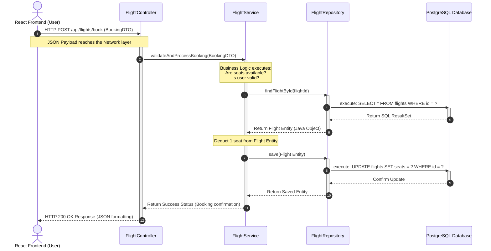
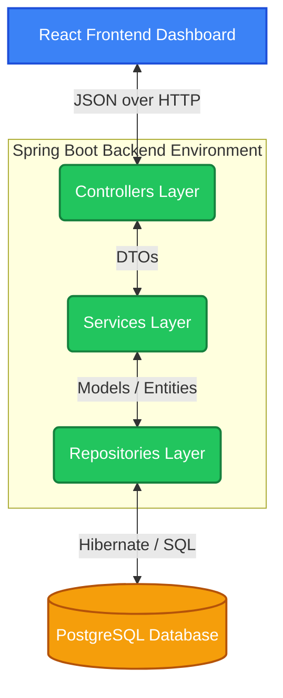

# BookMyFlight: Comprehensive Spring Boot Backend Architecture Guide

Welcome to the backend architecture guide for your **BookMyFlight** project! Since you are new to Spring Boot, this document is designed to give you a deep, foundational understanding of every moving part in the backend. 

Spring Boot is an opinionated framework built on top of the Java Spring Framework. It handles a lot of the boilerplate configuration so you can focus strictly on building the business logic of your flight booking system.

---

## 1. Folder & Package Structure In-Depth

Under your main backend directory (`src/main/java/com/bookmyflight/backend/`), the codebase is divided out into different "layers". This is commonly referred to as the **N-Tier Architecture** or **Controller-Service-Repository** pattern. The fundamental rule of this pattern is **Separation of Concerns**—no layer should do the job of another layer.

Here is the conceptual tree of your application:

```text
com.bookmyflight.backend
│
├── BackendApplication.java    <-- The Entry Point
├── controllers/               <-- The Web Layer (API Endpoints)
├── services/                  <-- The Business Layer (Logic)
├── repositories/              <-- The Data Access Layer (DB Queries)
├── models/                    <-- The Domain Layer (Database Entities)
└── dto/                       <-- The Transfer Layer (Data shaping)
```

### 1.1. `controllers/` (The Front Desk)
Think of a Controller as the receptionist of a hotel. It doesn't clean rooms or cook the food; it simply takes requests from guests (the Frontend), figures out what they want, asks the right hotel staff (the Services) to do it, and returns the result to the guest.
* **Role:** Intercepts incoming HTTP requests (like `/api/flights` or `/api/users/login`).
* **Annotations:** You will see `@RestController` and `@RequestMapping` defining standard web endpoints.
* **Important:** Controllers should have **zero business logic**. Their only job is to receive input, pass it down immediately to a `Service`, and format the output.

### 1.2. `services/` (The Brain)
This is where the actual work happens. The service layer executes the core rules of "BookMyFlight".
* **Role:** Calculating prices, applying discount coupons, verifying that a user is allowed to cancel a flight, or checking if two users are trying to book the exact same final seat.
* **Annotations:** Marked with `@Service`. 
* **Why it exists:** If we didn't have services, controllers would become incredibly messy and impossible to test. Services keep the logic isolated.

### 1.3. `repositories/` (The Warehouse Manager)
This layer talks strictly to PostgreSQL.
* **Role:** Fetching, saving, updating, and deleting data from your database tables.
* **The Magic of Spring Data JPA:** You don't have to write JDBC code or SQL strings. You create an `interface` extending `JpaRepository`, and Spring creates the memory instructions to execute operations perfectly underneath for you.
* **Example:** Just by writing a Java method `findFlightBySourceAndDestination(String source, String dest);`, Spring will auto-generate the exact SQL query required.

### 1.4. `models/` (The Database Entities)
Models are blueprints for your database tables. 
* **Role:** A class `User.java` decorated with `@Entity` represents the `users` table. Variables in this class (`String name`, `int age`) equate to table columns. 
* **Hibernate:** This mapping of "Java Object -> Relational Table Column" is performed by a tool called Hibernate (an Object Relational Mapper, or ORM).

### 1.5. `dto/` (Data Transfer Objects)
DTOs are custom-made parcels. 
* **Role:** Imagine your `User` model has a `password` field, a `failedLoginAttempts` field, and a `secretRecoveryHash` field in the database. When the React frontend asks for the user's profile, you **do not** want to send all that sensitive data back! 
* Instead, you create a `UserProfileDTO.java` class that *only* contains `username`, `email`, and `firstName`. The backend translates the `User` model into a `UserProfileDTO`, and sends the safe DTO to the frontend.

---

## 2. Deep Dive: Using the Database (PostgreSQL)

You have successfully connected a relational database via the `src/main/resources/application.properties` file. Let's break down exactly what your properties are successfully commanding the framework to do:

```properties
spring.datasource.url=jdbc:postgresql://localhost:5432/BookMyFlight
spring.datasource.username=postgres
spring.datasource.password=iAM100%MAD
```
* **What this does:** It provides the Java Database Connectivity (JDBC) instructions. It tells Spring the database type (postgres), where it is located (`localhost`), the exact port (`5432`), and the target database name (`BookMyFlight`). The bottom two lines securely authenticate you.

```properties
spring.jpa.hibernate.ddl-auto=update
spring.jpa.show-sql=true
spring.jpa.properties.hibernate.format_sql=true
spring.jpa.properties.hibernate.dialect=org.hibernate.dialect.PostgreSQLDialect
```
* **`ddl-auto=update`:** This is incredibly powerful. As you write or change your `models/` in Java (like adding private local variables), Hibernate will actively connect to Postgres and execute `ALTER TABLE` operations to keep the physical schema perfectly synched with your code.
* **`show-sql=true` & `format_sql=true`:** Every time your `repository/` layer performs an action, the exact raw SQL executed will be beautifully printed into your backend console logs for debugging.
* **`dialect`:** Tells Hibernate the exact flavor of SQL to generate, since PostgreSQL SQL syntax slightly differs from MySQL or Oracle SQL.

---

## 3. The Flow of Execution (With Diagrams)

To understand exactly how code is executed sequentially upon receiving a booking request, follow this interaction sequence diagram. 

### 3.1. End-To-End Sequence Diagram



**Step-by-Step Breakdown:**
1. **Request:** The frontend triggers an HTTP hit to your Controller, accompanied by a JSON payload (the desired booking details).
2. **Delegation:** The Controller unpacks the JSON into a Java DTO and passes it strictly to the Service layer for "thinking".
3. **Internal Logic:** The Service layer executes actual decision-making algorithms. It requires data to think, so it calls the Repository.
4. **Data Fulfillment:** The Repository performs the complex Hibernate translation into SQL, hits PostgreSQL, and hands the resulting Java entities back up.
5. **Modification:** The Service does math (subtracting a seat) and issues a `save()` command back to the Repository to persist the new state permanently.
6. **Response:** Finally, a response ripples backward out to the frontend, which will alert the User of success.

### 3.2. Layered Architecture Diagram



---

## 4. Frontend & Backend Interaction

Your Spring Boot backend and React frontend are disparate systems. They do not share memory or a programming language. To bridge this, they communicate via **REST APIs**.

### 4.1. Universal Language: JSON
When communication happens, all information is flattened into JSON (JavaScript Object Notation). 
* When React sends a registration form, it produces:
  ```json
  { "username": "tamal22", "password": "123", "email": "tamal@gmail.com" }
  ```
* Spring automatically detects this JSON and uses an internal library called *Jackson* to map that text directly into your `UserRegistrationDTO` class. 

### 4.2. REST Operations (Verbs)
APIs use "HTTP Verbs" to specify intent. This maps perfectly to standard database CRUD (Create, Read, Update, Delete) operations.

| HTTP Method | Frontend Action | Backend Equivalent | What it does |
|-------------|-----------------|--------------------|--------------|
| **`GET`** | Navigates to `/flights` | `flightService.getAll()` | **Read** data safely without altering existing states. |
| **`POST`** | Submitting Checkout | `bookingService.save()` | **Create** entirely new database records. |
| **`PUT`** | Changing an Avatar | `userService.update()` | **Update** or overwrite an entire existing record. |
| **`DELETE`**| Cancelling a Flight | `bookingService.delete()`| **Delete** an existing record. |

### 4.3. The Problem of CORS (And the Solution)
By default, web browsers hold a strict security protocol called the **Same-Origin Policy**. 
If a user is browsing your React app at `http://localhost:3000`, the browser strictly prevents JavaScript code from trying to steal data by making secret HTTP requests to `http://localhost:8080` (where your Spring App lives).

The browser sees two different ports (`3000` vs `8080`) and blocks it instantly contextually classifying it as a potential hacking attempt. 

To override this, the Backend **must formally announce that it trusts the source**. 
You have achieved this using the CORS (Cross-Origin Resource Sharing) properties in `application.properties`:

```properties
spring.web.cors.allowed-origins=*
spring.web.cors.allowed-methods=*
```
* **What this means:** You are telling Spring Boot: "Before executing my controllers, automatically respond to the browser's security check allowing incoming requests from ANY (`*`) origin, using ANY (`*`) HTTP method." This clears the way for a smooth React-to-Spring connection!
